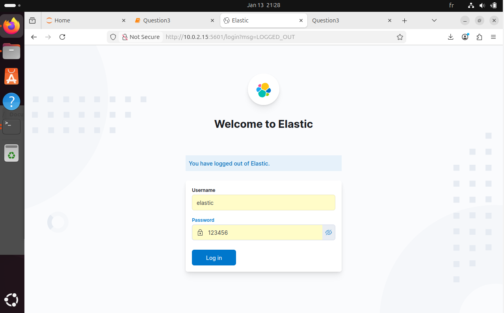

# Secure-ELK-Stack-with-Instagram-Data-Collection-Sentiment-Analysis

## 📌 Project Overview

This project focuses on deploying and securing an ELK Stack (Elasticsearch, Logstash, Kibana) on a Linux virtual machine, combined with Instagram data collection, MongoDB storage, and sentiment analysis.

The main objective is to build a secure, end-to-end data pipeline that collects social media data, enriches it with sentiment analysis, indexes it into Elasticsearch, and visualizes insights through Kibana dashboards.

## 🏗️ Global Architecture
```
Instagram
   ↓
Python Script (Instaloader)
   ↓
MongoDB
   ↓
Logstash
   ↓
Elasticsearch
   ↓
Kibana (Dashboards & Analytics)

 ```
### 🛠️ ELK Stack Installation
**1️⃣ Elasticsearch**

-Installation and service configuration

-Cluster startup and health verification

-Access via:
http://localhost:9200

**2️⃣ Kibana**

-Configuration of Elasticsearch connection

-Web interface access via:
http://localhost:5601

**3️⃣ Logstash**

-Pipeline configuration (input, filter, output)

-Verification of data ingestion from MongoDB into Elasticsearch

## 🔐 Security & Authentication

The ELK stack is fully secured using X-Pack Security:

- X-Pack Security enabled

- User and role creation

- Role-based access control (RBAC)

- Secured access to Elasticsearch and Kibana

- Mandatory authentication (username & password)



### ⚙️ Technologies Used

**🔹 ELK Stack**

Elasticsearch – indexing and search engine

Logstash – data ingestion and transformation

Kibana – data visualization and dashboards

**🔹 Backend & Data**

Python 3

Instaloader (Instagram scraping)

MongoDB

PyMongo

**🔹 Security**

X-Pack Security

User authentication

Role and permission management

**🖥️ Environment**

Ubuntu 24.04.3

Elasticsearch, Logstash, Kibana 7.17.29

JVM 22.0.2

Local MongoDB instance

## 🕷️ Instagram Data Collection

A Python script is used to extract Instagram posts based on a given hashtag.

**🔎 Collected Data**

Username

Post content

Number of likes

Publication date

Post URL

**💾 Data Storage (MongoDB)**

Extracted data stored in MongoDB

Dedicated database and collection

Duplicate prevention using upsert operations

MongoDB serves as the data source for Logstash

**🧠 Sentiment Analysis**

Instagram post texts are analyzed to:

-Detect overall sentiment (positive, negative, neutral)

-Enrich documents before indexing into Elasticsearch

-Enable sentiment-based filtering and visualization in Kibana

### 📬 Contact

👤 Hadir DRISS

📧 Email : hadirdriss6@gmail.com

💼 GitHub : https://github.com/hadirdriss

🔗 LinkedIn : https://www.linkedin.com/in/hadir-driss-287202206/
